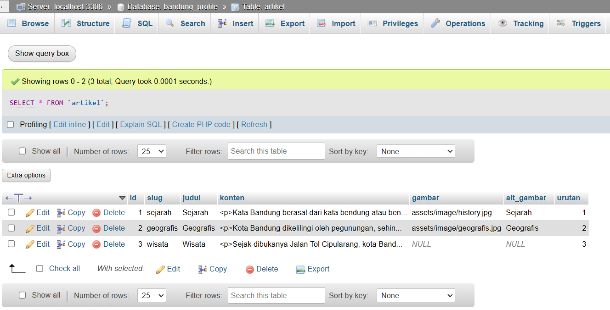

# Halaman Profil Kota bandung
Proyek ini disusun untuk memenuhi tugas mata kuliah "Pemrograman Web"

---

## Screenshot Tampilan Website


## Screenshot Tampilan Database


---

## Struktur Project
```
├── assets
│ └── image
│
├── scripts
│ └── script.js
│
├── styles
│ └── style.css
│
├── config
│ └── database.php
│
├── index.php
└── README.md
```

### Keterangan
- **assets/**   → Menyimpan file statis seperti gambar
- **scripts/**  → Berisi file JavaScript
- **styles/**   → Berisi file CSS
- **config/**   → Konfigurasi aplikasi (koneksi database)
- **index.php** → Halaman utama aplikasi
- **README.md** → Dokumentasi project

---

## Disusun Oleh:
```
Nama    : MUHAMAD DIKRULLOH
NIM     : 2430511076
Kelas   : 4B
Prodi   : Teknik Informatika
```